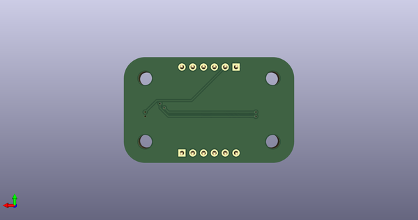
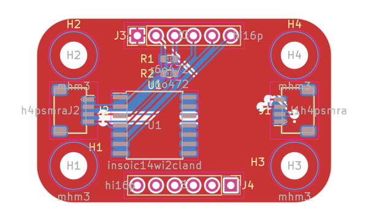

# IBBC Breakout Board Holder OOBB 3 x 2
A breakout board holder for ibbc interface boards.

## schematic  
  
[schematic (pdf)](kicad/current_version/working/working_schematic.pdf)  

## pcb  
 
  
  
  
[board (pdf)](kicad/current_version/working/working.pdf)  

## corel working
 

## working_bom
| Id | Designator | Footprint | Quantity | Designation | Supplier and ref |  | None | 
| --- | --- | --- | --- | --- | --- | --- | --- | 
| 1 | H2,H4,H3,H1 | [electronic_mounting_hole_m3](https://github.com/oomlout/oomlout_oomp_part_src/tree/main/parts/electronic_mounting_hole_m3/working) | 4 | mhm3 |  |  | [''] | 
| 2 | R1,R2 | [electronic_resistor_0603_4700_ohm](https://github.com/oomlout/oomlout_oomp_part_src/tree/main/parts/electronic_resistor_0603_4700_ohm/working) | 2 | r6o472 |  |  | [''] | 
| 3 | J3,J4 | [electronic_header_2d54_mm_6_pin](https://github.com/oomlout/oomlout_oomp_part_src/tree/main/parts/electronic_header_2d54_mm_6_pin/working) | 2 | hi16p |  |  | [''] | 
| 4 | J2,J1 | [electronic_header_1_mm_jst_sh_4_pin_surface_mount_right_angle](https://github.com/oomlout/oomlout_oomp_part_src/tree/main/parts/electronic_header_1_mm_jst_sh_4_pin_surface_mount_right_angle/working) | 2 | h4psmra |  |  | [''] | 
| 5 | U1 | [electronic_interposer_soic_14_wide_i2c_landing](https://github.com/oomlout/oomlout_oomp_part_src/tree/main/parts/electronic_interposer_soic_14_wide_i2c_landing/working) | 1 | insoic14wi2cland |  |  | [''] | 

## working_parts
| designator | oomp_key | placed | note | position_x | position_y | rotation | offset_x | offset_y | 
| --- | --- | --- | --- | --- | --- | --- | --- | --- | 
| H1 | [oomp_electronic_mounting_hole_m3](https://github.com/oomlout/oomlout_oomp_part_src/tree/main/parts/electronic_mounting_hole_m3/working) |  |  | -15 | -7.5 |  |  |  | 
| H2 | [oomp_electronic_mounting_hole_m3](https://github.com/oomlout/oomlout_oomp_part_src/tree/main/parts/electronic_mounting_hole_m3/working) |  |  | -15 | 7.5 |  |  |  | 
| H3 | [oomp_electronic_mounting_hole_m3](https://github.com/oomlout/oomlout_oomp_part_src/tree/main/parts/electronic_mounting_hole_m3/working) |  |  | 15 | -7.5 |  |  |  | 
| H4 | [oomp_electronic_mounting_hole_m3](https://github.com/oomlout/oomlout_oomp_part_src/tree/main/parts/electronic_mounting_hole_m3/working) |  |  | 15 | 7.5 |  |  |  | 
| J1 | [oomp_electronic_header_1_mm_jst_sh_4_pin_surface_mount_right_angle](https://github.com/oomlout/oomlout_oomp_part_src/tree/main/parts/electronic_header_1_mm_jst_sh_4_pin_surface_mount_right_angle/working) |  |  | 15 | 0 | 90 |  |  | 
| J2 | [oomp_electronic_header_1_mm_jst_sh_4_pin_surface_mount_right_angle](https://github.com/oomlout/oomlout_oomp_part_src/tree/main/parts/electronic_header_1_mm_jst_sh_4_pin_surface_mount_right_angle/working) |  |  | -15 | 0 | -90 |  |  | 
| U1 | [oomp_electronic_interposer_soic_14_wide_i2c_landing](https://github.com/oomlout/oomlout_oomp_part_src/tree/main/parts/electronic_interposer_soic_14_wide_i2c_landing/working) |  |  | -4 | -2 |  |  |  | 
| J3 | [oomp_electronic_header_2d54_mm_6_pin](https://github.com/oomlout/oomlout_oomp_part_src/tree/main/parts/electronic_header_2d54_mm_6_pin/working) |  |  | -6.35 | 10.16 | 90 |  |  | 
| J4 | [oomp_electronic_header_2d54_mm_6_pin](https://github.com/oomlout/oomlout_oomp_part_src/tree/main/parts/electronic_header_2d54_mm_6_pin/working) |  |  | 6.35 | -10.16 | -90 |  |  | 

## oomp_parts_summary
| index | designator | quantity | oomp_id | 
| --- | --- | --- | --- | 
| 1 | H2,H4,H3,H1 | 4 | [electronic_mounting_hole_m3](https://github.com/oomlout/oomlout_oomp_part_src/tree/main/parts/electronic_mounting_hole_m3/working) [mhm3](https://github.com/oomlout/oomlout_oomp_part_src/tree/main/parts/electronic_mounting_hole_m3/working)  | 
| 2 | R1,R2 | 2 | [electronic_resistor_0603_4700_ohm](https://github.com/oomlout/oomlout_oomp_part_src/tree/main/parts/electronic_resistor_0603_4700_ohm/working) [r6o472](https://github.com/oomlout/oomlout_oomp_part_src/tree/main/parts/electronic_resistor_0603_4700_ohm/working)  | 
| 3 | J3,J4 | 2 | [electronic_header_2d54_mm_6_pin](https://github.com/oomlout/oomlout_oomp_part_src/tree/main/parts/electronic_header_2d54_mm_6_pin/working) [hi16p](https://github.com/oomlout/oomlout_oomp_part_src/tree/main/parts/electronic_header_2d54_mm_6_pin/working)  | 
| 4 | J2,J1 | 2 | [electronic_header_1_mm_jst_sh_4_pin_surface_mount_right_angle](https://github.com/oomlout/oomlout_oomp_part_src/tree/main/parts/electronic_header_1_mm_jst_sh_4_pin_surface_mount_right_angle/working) [h4psmra](https://github.com/oomlout/oomlout_oomp_part_src/tree/main/parts/electronic_header_1_mm_jst_sh_4_pin_surface_mount_right_angle/working) [JST - BM04B-SRSS-TB ](https://www.jst-mfg.com/product/index.php?series=231)[JST - SM04B-SRSS-TB ](https://www.jst-mfg.com/product/index.php?series=231) | 
| 5 | U1 | 1 | [electronic_interposer_soic_14_wide_i2c_landing](https://github.com/oomlout/oomlout_oomp_part_src/tree/main/parts/electronic_interposer_soic_14_wide_i2c_landing/working) [insoic14wi2cland](https://github.com/oomlout/oomlout_oomp_part_src/tree/main/parts/electronic_interposer_soic_14_wide_i2c_landing/working)  | 

